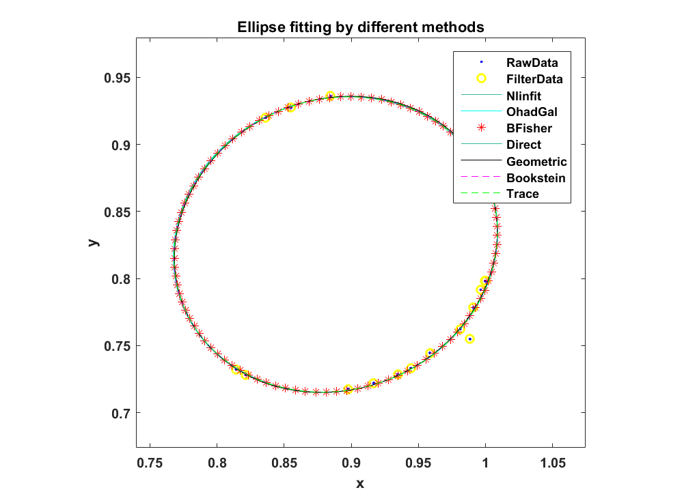
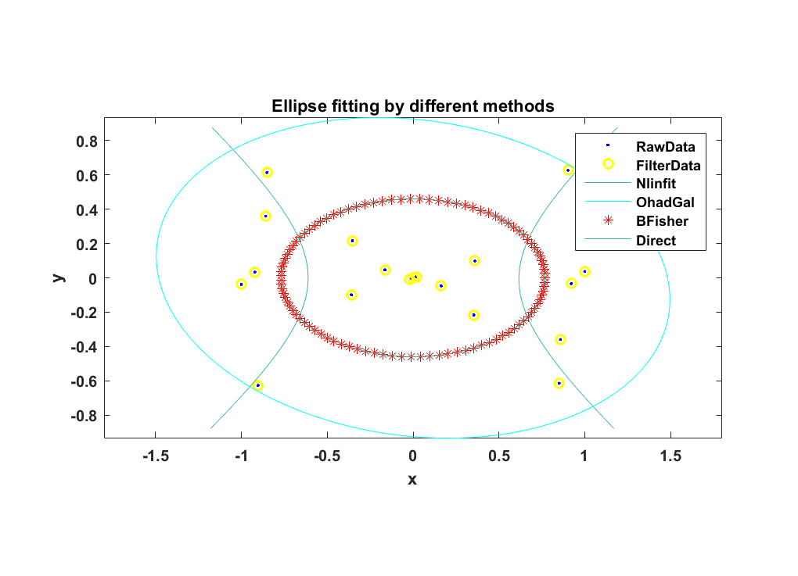
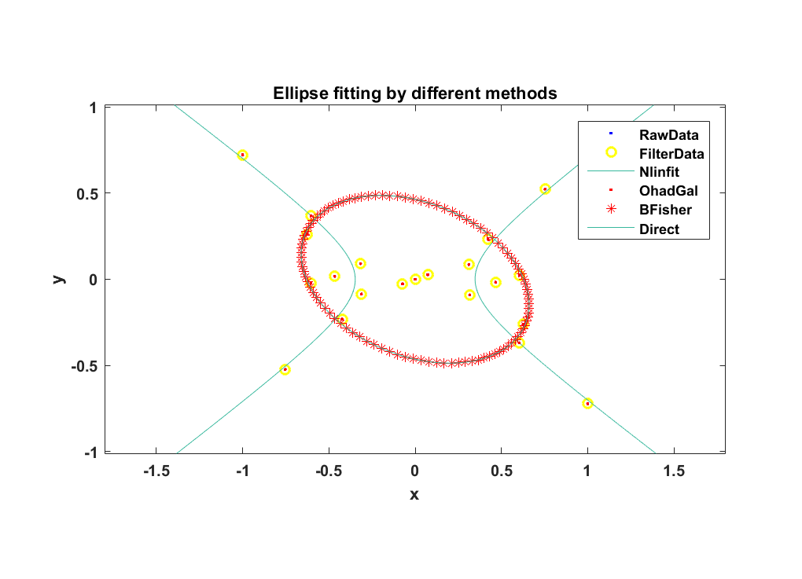
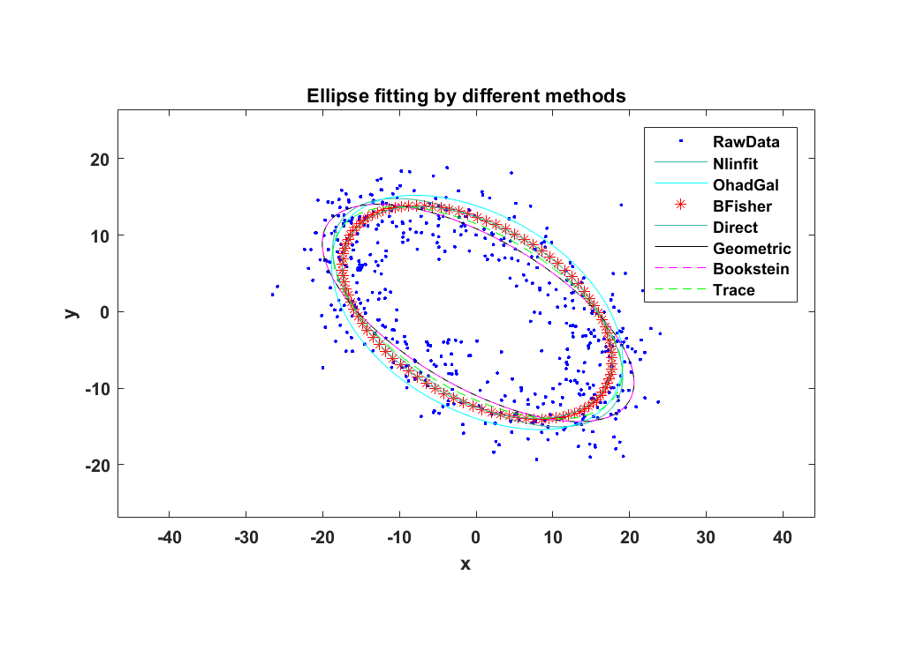
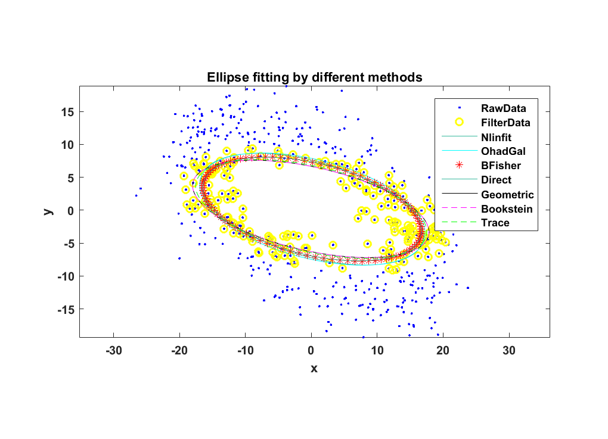

# EllipseFit
## Abstract
- Study theories of ellipse fitting
- Coding to realize ellipse fitting, _matlab_ and _C++_
- Make comparison of different ellipse fitting theories or functions
- Considering the disadvantages of least square fitting methods for conic section,
search an effective and robost method. 

## Methods Comparison Through Matlab Code
- Description: make comparison of five types of ellipse fitting methods or functions
- Codes: ./matlab
- Figures: ./figures
- Methods
    1. General Conic Fitting With Least Squares Method
        - funcEllipseFit_nlinfit

            Description: General conic fitting by calling _nlinfit_ function in matlab,
            and return fitted conic coefficients of ellipse, parabola or hyperbola,
            depending on the distribution of scattered points. 

        - funcEllipseFit_OGal
            
            Description: Ellipse fitting using least squares criterion and return
            structure containing fitted status and geometric parameters of ellipse.
            If ellipse fitting failed, status is parabola or hyperbola and geometric
            parameters are null; if ellipse fitting succeeded, status is null and
            geometric parameters are returned.This method is implemented by Ohad Gal.

    2. Constrainted Conic Fitting with Least Squares Method
        - funcEllipseFit_RBrown
            
            Description: Ellipse fitting using nonlinear least squares by
            optimising the squared sum of orthogonal distances from the 
            points to the fitted ellipse, with Bookstein or Euclidean-invariant
            constraints. This method is implemented by Richard Brown.

        - [funcEllipseFit_BFisher](http://homepages.inf.ed.ac.uk/rbf/CVonline/LOCAL_COPIES/FITZGIBBON/ELLIPSE/)
            
            Description: **Direct** least squares fitting of ellipse with several 
            advantages: (i) It is ellipse-specific so that even bad data will
            always return an ellipse; (ii) It can be solved naturally by a
            generalized eigensystem and (iii) it is extremely robust, efficient
            and easy to implement. This method is implemented by Bob Fisher,
            and geometric ellipse parameters are returned.

        - funcEllipseFit_direct
            
            Description: Another implementation of **direct ellipse fitting**
            developed by Bob Fisher and his coworkers. This method is 
            implemented by Nikolai Chernov, and conic coefficients of ellipse
            are returned.
- Examples

     The examples are presented to illustrate the effectiveness of above methods,
     and make some comparison.

    1. Perfect ellipse-shaped scatters
    
        
        
        For perfect ellipse-shaped scatters, all above methods make perfect
        ellipse fitting implementation.
    
    2. Hyperbola-Ellipse scatters
    
        
        
        For hyperbola-shaped scatters with some distribution features of ellipse,
        funcEllipseFit_nlinfit method could fitted a hyperbola, funcEllipseFit_OGal
        and both direct ellipse fitting methods gave a fitted ellipse, where fitted
        ellipse by funcEllipseFit_OGal may a little diverge from scatters, while
        funcEllipseFit_RBrown method failed.

    3. Hyperbola-shaped scatters
    
        
        
        For hyperbola-shaped scatters, funcEllipseFit_nlinfit method could fit
        a hyperbola, and direct ellipse fitting methods gave a fitted ellipse,
        while other methods failed.
    
    4. Perfect ellipse-shaped scatters
        
        For this example, Random Sample Consensus (RANSAC) filtering are performed.
        Despite the fitting comparison of different ellipse fitting methods, the
        effect of RANSAC is also demonstrated.
        
        
        
        
        For noisy scattered points, RANSAC filtering can effectively eliminate 
        the influence of noise, and be helpful for better ellipse fitting.

        For different ellipse fitting methods, the direct methods always present
        the best performance. 

## Direct Ellipse Fitting Method Implementation in C++
- Description: Implement direct ellipse fitting method in C++ template class
- Folder: ./C++
- Class: DirectEllipseFit (DirectEllipseFit.h & DirectEllipseFit.cpp)
- Usage
    1. Create object

        DirectEllipseFit<type> ellipFit(xVec, yVec);

    2. Perform ellipse fitting and get fitted ellipse

        Ellipse ellip = ellipFit.doEllipseFit();

## Conclusions
Through the methods description and examples demonstration, we can conclude
that direct least squares method is perfect in ellipse fitting, with efficiency,
robustness and accuracy.

What's more, both the matlab and C++ programs are implemented, which can be
used in industrial application.

## Reference
1. [Fitzgibbon, A., et al. (1996). "Direct least square fitting of ellipses." IEEE Transactions on pattern analysis and machine intelligence 21(5): 476-480.](./1996-Fitzgibbon-Direct least square fitting of ellipses.pdf)